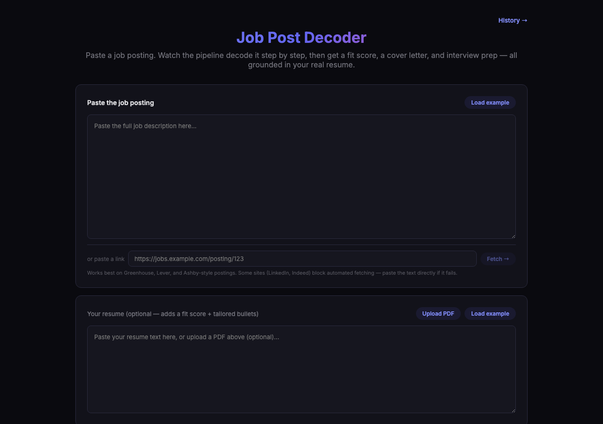
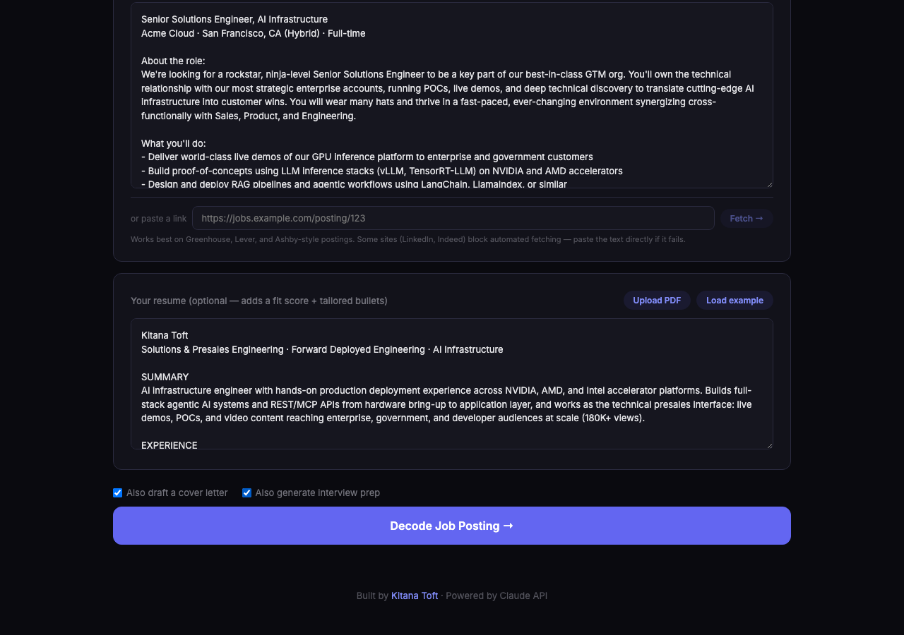
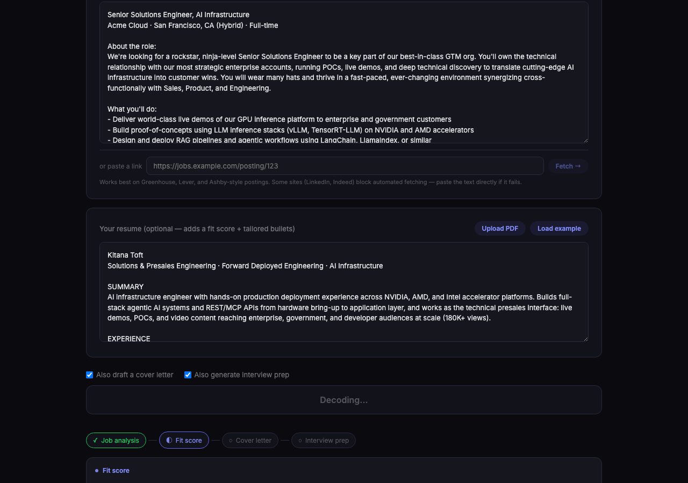
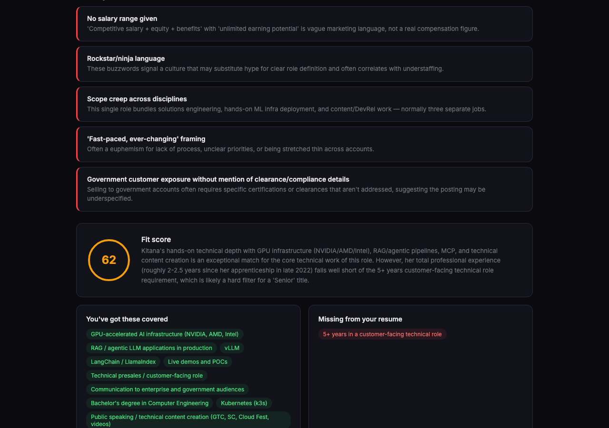
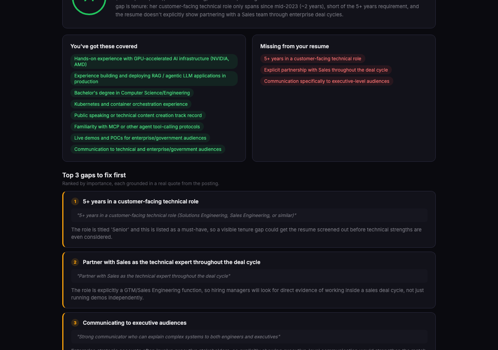
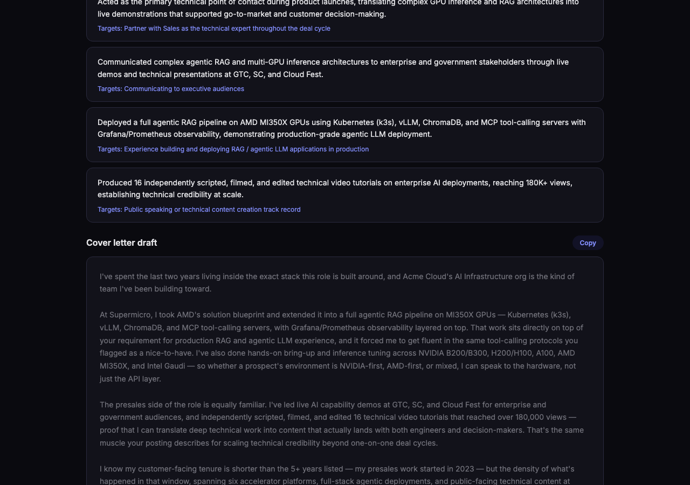
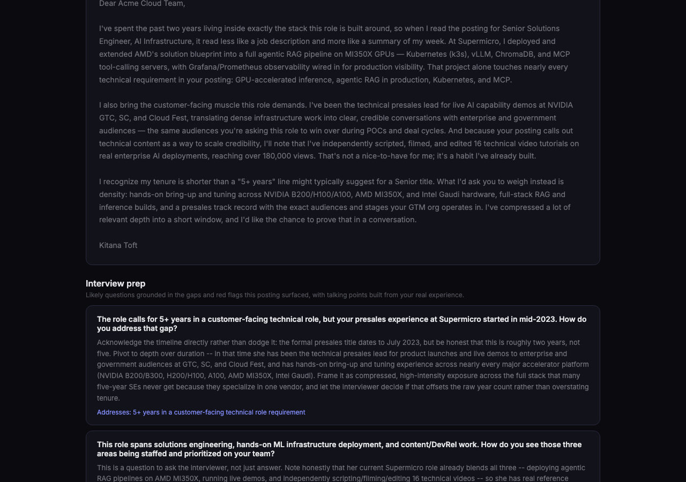
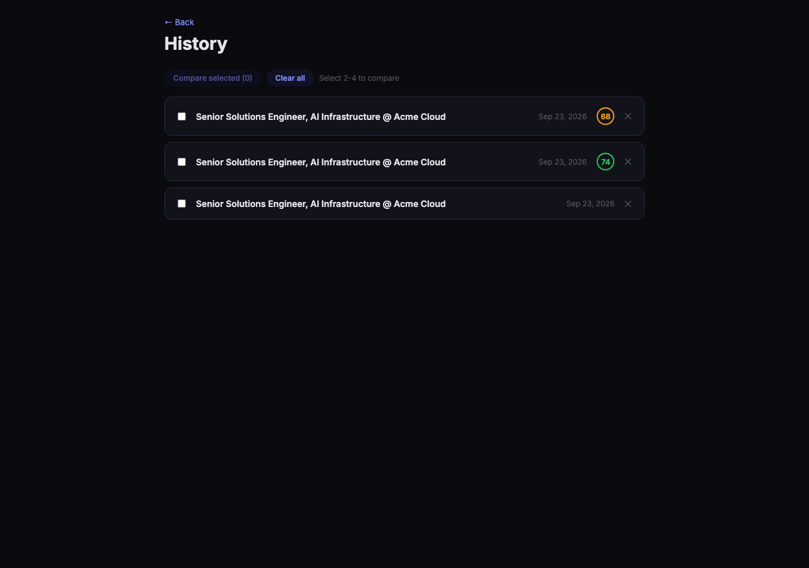
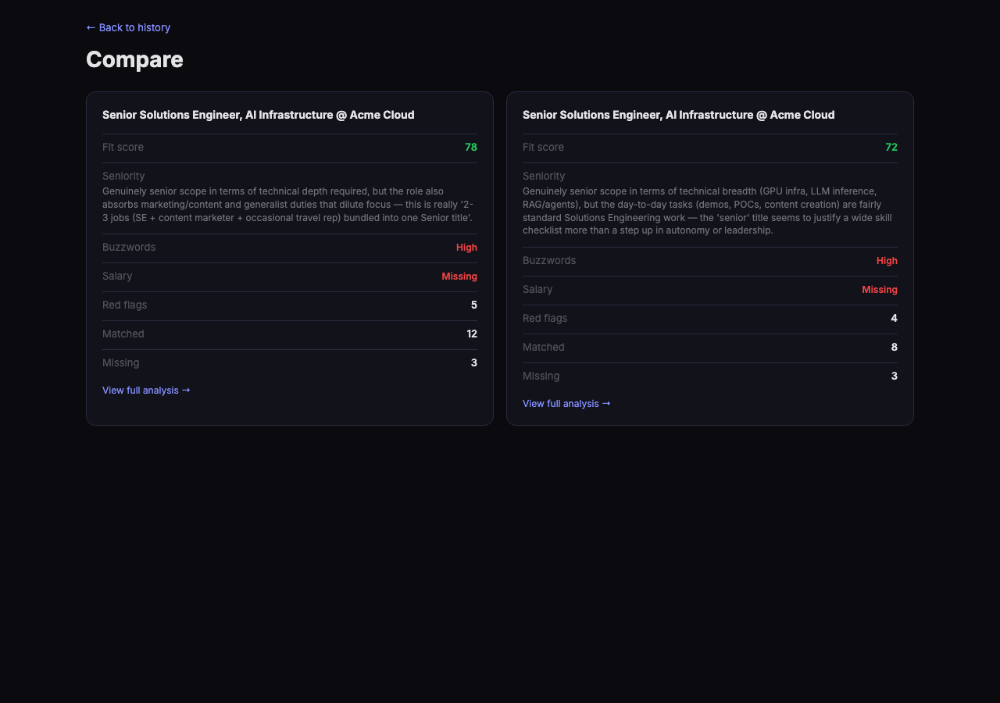

# Job Post Decoder

Paste a job posting. Watch a four-step agent pipeline decode it live — the real requirements, the red flags, an honest fit score, a cover letter, and interview prep — then revisit and compare every decode later from your history.



## What it does

1. Paste a job posting, or a link to one
2. **Job analysis** — extracts what the role actually is: must-haves vs. nice-to-haves, true seniority level, buzzword density, salary transparency, and concrete red flags with reasoning
3. Optionally add your resume (paste text or upload a PDF) — **fit analysis** scores your fit (0–100), lists matched/missing keywords, ranks the top 5 gaps with evidence quoted straight from the posting, and drafts XYZ-format resume bullets that surface real experience you already have
4. Optionally generate a **cover letter draft** and/or **interview prep** — both grounded only in what the fit analysis already found and what's actually on your resume
5. Every decode auto-saves to a local history you can revisit, compare side-by-side, or delete

Every agent is instructed the same way: never invent experience, metrics, or skills the resume doesn't support — only rephrase or resurface what's already there.

## Why a streaming pipeline, not one big call

Each step is a separate model call, run in sequence, streamed to the browser over SSE as it happens — so the analysis reveals step by step instead of disappearing behind one loading spinner. Each step's prompt is also seeded with the previous steps' structured output (fit analysis gets the job analysis's extracted requirements; the cover letter and interview prep both get the fit analysis's gaps), which keeps every step focused and grounded in the same facts a human reading top-to-bottom would see. If a later step fails — say interview prep hits a malformed-JSON response — the steps that already succeeded stay on screen; only the failed step shows an error, and it retries the underlying model call once automatically before giving up.

## Features

- **Role decoder** — plain-English summary of what you'd actually spend your day doing
- **Paste a link** — server-side fetch turns a job posting URL into text automatically (works best on Greenhouse/Lever/Ashby-style pages; JS-heavy sites like LinkedIn often block it, so pasting text is always the fallback)
- **PDF resume upload** — parsed entirely in your browser with pdfjs-dist; the file itself is never sent to the server, only the extracted text
- **Red flag detection** — vague/missing salary, "wear many hats," rockstar/ninja language, scope creep across disciplines, unrealistic seniority-vs-requirements combos
- **Live streaming pipeline** — a step-by-step progress indicator plus a raw live-text panel while each step is generating, so the multi-agent architecture is visible, not a black box
- **Fit score** — honest 0–100 match against a resume, with reasoning
- **Top 5 priority gaps** — the missing requirements ranked by importance, each backed by a real quote from the posting
- **Tailored bullets** — XYZ-format suggestions built only from real resume content, each mapped to the requirement it targets
- **Cover letter draft** — a ready-to-send letter, streamed live as plain prose, with a copy button
- **Interview prep** — likely questions and honest talking points grounded in the specific gaps and red flags already found
- **History + compare** — every decode auto-saves locally (resume text itself is never stored, only the analysis results); revisit any past decode or compare 2-4 side by side on fit score, buzzwords, salary transparency, and keyword counts
- **Rate limited** — basic per-IP sliding window on both API routes
- **SSRF-guarded URL fetch** — blocks localhost/private/link-local addresses (including the cloud metadata IP), enforces an http(s)-only + redirect-revalidating fetch with a size cap and timeout

## Tech stack

- **SvelteKit** — full-stack framework, SSE streaming API routes
- **Anthropic Claude API** — four-step streaming agent pipeline
- **pdfjs-dist** — client-side PDF text extraction
- **TypeScript** — end-to-end type safety
- **Vitest** — unit tests for JSON extraction, rate limiting, the SSRF guard, HTML-to-text conversion, prompt builders, and the history store

## Architecture

```
src/
├── routes/
│   ├── +page.svelte              # main page: inputs + live pipeline + results
│   ├── api/decode/+server.ts     # SSE endpoint — runs the streaming agent pipeline
│   ├── api/fetch-url/+server.ts  # SSRF-guarded job-posting-URL-to-text fetch
│   └── history/                  # list, detail ([id]), and compare routes (client-only)
├── lib/
│   ├── components/
│   │   ├── ui/                   # Card, Badge, Button, SectionHeading — shared primitives
│   │   ├── input/                # job posting / resume / submit-bar inputs
│   │   ├── pipeline/              # PipelineProgress, StreamingStepPanel
│   │   ├── results/               # one component per result section (fit score, gaps, etc.)
│   │   └── history/               # history list/card, compare grid
│   ├── server/
│   │   ├── prompts.ts             # pure prompt-builder functions, one per pipeline step
│   │   └── streamAgent.ts         # wraps the Anthropic streaming call
│   ├── client/
│   │   ├── decodeStream.ts        # parses the SSE response into typed events
│   │   ├── pdf.ts                 # client-side PDF → text (pdfjs-dist)
│   │   └── fitColor.ts
│   ├── storage/historyStore.ts    # HistoryStorage interface + localStorage implementation
│   ├── urlFetch.ts                # SSRF guard + HTML → text
│   ├── rateLimit.ts, parse.ts
│   └── types.ts                   # shared types, incl. the DecodeEvent protocol below
```

**The SSE event protocol.** `/api/decode` streams `data: {...}\n\n` lines, each one a `DecodeEvent` (defined in `src/lib/types.ts`):

```ts
type PipelineStep = 'job' | 'fit' | 'coverLetter' | 'interviewPrep';

type DecodeEvent =
  | { type: 'step-start'; step: PipelineStep }
  | { type: 'delta'; step: PipelineStep; text: string }          // raw streamed text
  | { type: 'step-complete'; step: PipelineStep; data: ... }     // parsed result for that step
  | { type: 'step-skipped'; step: PipelineStep; reason: string } // e.g. no resume given
  | { type: 'error'; step?: PipelineStep; message: string }
  | { type: 'done' };
```

The client (`decodeStream.ts`) reads the response body as a stream and parses it with a small hand-rolled SSE reader rather than the browser's `EventSource` API — `EventSource` only supports `GET`, and the job posting + resume payload has to go over `POST`. Each `JobAnalysis`/`FitAnalysis` step also runs through `streamJsonStep()` in `+server.ts`, which retries the model call once if the JSON comes back malformed before surfacing an error — LLM JSON output is not 100% reliable, and a fresh generation is more likely to parse than trying to repair broken text.

**Storage.** History lives behind a small `HistoryStorage` interface (`list`/`get`/`save`/`remove`/`clear`) with a `LocalStorageHistoryStore` implementation. Nothing above that interface knows it's `localStorage` — swapping in a real backend (Postgres/Supabase, say) later is a new class, not a rewrite.

## Environment variables

| Variable | Required | Purpose |
|---|---|---|
| `ANTHROPIC_API_KEY` | Yes | Powers every pipeline step. Without it, `/api/decode` returns a 500 with a clear "Server is not configured" message instead of failing opaquely. |

Copy `.env.example` to `.env` and fill it in — see Quick start below.

## Limitations & known tradeoffs

Documented deliberately, not discovered by a reviewer:

- **History is per-browser, not synced.** It's `localStorage`, so it doesn't follow you across devices or survive clearing site data. That's a real limitation for a "job search companion," and the swappable `HistoryStorage` interface exists specifically so this can change later without touching every call site.
- **URL fetching doesn't work everywhere.** LinkedIn, Indeed, and other JS-heavy or bot-guarded sites will often return an empty shell or a block page. Pasting the text directly is always the fallback, and the UI says so.
- **No auth, no multi-user concerns.** This is a single-user tool by design, not a corner that was cut — there's nothing here that needs a login.
- **JSON-mode LLM output, not tool-use/structured output.** The job/fit/interview-prep steps ask the model to "return ONLY valid JSON" rather than using Anthropic's structured tool-calling output, which would guarantee schema-valid JSON. The current approach needed a one-retry safety net (see Architecture) to reach acceptable reliability; moving these three steps to tool-use is the most impactful reliability upgrade still on the table.
- **No automated UI/E2E tests.** The test suite (`npm test`) covers pure logic — JSON extraction, rate limiting, the SSRF guard, prompt builders, the history store — but every pipeline/streaming/UI behavior described in the Walkthrough has only been verified manually.

## Quick start

```bash
git clone https://github.com/kctoft/job-post-decoder.git
cd job-post-decoder
npm install
cp .env.example .env   # add your Anthropic API key
npm run dev
```

Open [http://localhost:5173](http://localhost:5173)

## Walkthrough

**1. Start with a job posting.** Paste the text directly, hit "Load example" to try it on a deliberately buzzword-heavy fake posting ("rockstar, ninja-level," no salary range, three jobs bundled into one), or paste a link and hit "Fetch →" to pull the text automatically from the page.

**2. Add your resume (optional).** Paste it as text or hit "Upload PDF" — parsing happens entirely in your browser via pdfjs-dist, so the file itself never touches the server. Once a resume is present, two checkboxes appear: "Also draft a cover letter" and "Also generate interview prep." Both are off by default, so a plain decode only costs 1-2 model calls.



**3. Hit "Decode Job Posting →" and watch the pipeline run live.** A step indicator appears — Job analysis → Fit score → Cover letter → Interview prep — each bubble moving from a hollow pending circle, to a pulsing "streaming" state, to a green checkmark. While a step is generating, a live panel underneath shows its raw output arriving token by token: JSON for job/fit/interview-prep, plain prose for the cover letter (the most satisfying one to watch — an actual letter typing itself out in real time).



**4. Results appear as each step finishes** — you don't wait for the whole pipeline:
- **Job analysis** lands first: a plain-English role summary, badges for seniority/buzzword density/salary transparency, must-haves vs. nice-to-haves side by side, and a red-flags list (or a "reads clean" note if there genuinely aren't any).
- **Fit score** appears next as a color-coded 0-100 gauge (green/amber/red) with an honest summary — it won't inflate your odds. Below it: what you've already got covered, what's missing, and a **top-5 priority gaps** list, each one backed by a real quoted snippet from the posting so you can see exactly why it flagged that gap.

  
  

- **Suggested resume bullets** follow, in XYZ format, each one built only from facts already on your resume and mapped to the specific gap it addresses.
- **Cover letter** (if requested) renders in its own card with a one-click copy button.
- **Interview prep** (if requested) renders as a list of likely questions paired with honest talking points — grounded in the same gaps and red flags already surfaced, not invented on the spot.

  
  

**5. Every decode auto-saves.** Click "History →" in the header to see every past decode as a card (role title, date, fit-score badge). Click into one to replay the full analysis, select 2-4 and hit "Compare selected" to see them side by side on fit score, seniority, buzzword density, salary transparency, and keyword counts — useful for deciding which of several postings is actually worth your time. Resume text itself is never stored in history, only the analysis output.




**6. If something fails partway through, you keep what already succeeded.** Each step runs and streams independently — if, say, interview prep hits a malformed response, the job analysis, fit score, and cover letter you already saw stay exactly as they are; only that one step shows an error (after retrying once automatically). The third entry in the history screenshot above is a real example of this — its fit step failed on that run, so it saved with a job analysis but no fit-score badge, instead of losing the decode entirely.

## Tests

```bash
npm test
```

## Author

**Kitana Toft** — [kitanatoft.com](https://kitanatoft.com) · [GitHub](https://github.com/kctoft)

## License

MIT
